## 开始之前

Q：我什么都不会，我该怎么办？

A：最好先翻一翻课本，初步认识一下流水线，至少要知道流水线的分段、流水线暂停、延时槽机制。


Q：有什么资料可以参考吗？

A：教材、实验指导、《自己动手写CPU》（在写代码的时候很有帮助）、MIPS指令手册、自己之前写的CPU、学长代码。当然，阅读完本指南，相信你就能解决大部分问题！


Q：这次的静态流水线有什么要求？

A：主要就是通过流水线暂停处理数据冲突，通过提前分支判断和延时槽处理转移指令。**但其实**，本次设计的流水线严格来说并不属于“静态流水线”。静态流水线是指在同一段时间内，流水线中的各个功能段只能按照一种固定的方式连接，实现一种固定的功能。而我们所设计的流水线，在同一时刻的不同流水段可以处理不同种类的指令，因此说不上是“静态”的。*那为什么我们还要这样叫？上一届这么叫，我们也就跟着这样叫了（*


Q：太长了我不想看！

A：我已经在不影响阅读效果的基础上对内容尽量进行了压缩，如果你还是觉得太长了，至少把下面这几句话看完：根据指令画数据通路图，编排指令流程表。根据流程表写控制器的控制信号，根据通路图连接部件。数据冲突的检测和流水线暂停交由控制器处理，控制器为纯组合逻辑。仿真时通过Mars寄存器比较找错，综合时别忘了设置时序约束。


Q：发现指南有问题怎么办？

A：受限于硬件课程组日新月异的要求和本人有限的水平，所有内容仅供参考。如果发现存在问题，欢迎在Issues区提出。

## 从一张白纸开始

设计一个CPU最开始要干什么？我的回答是画图和填表。

弄清楚有哪些部件，部件之间如何连接，每条指令在每个阶段要进行什么操作。

打开drawio或者随便一个画图软件，开始我们的CPU设计之旅！

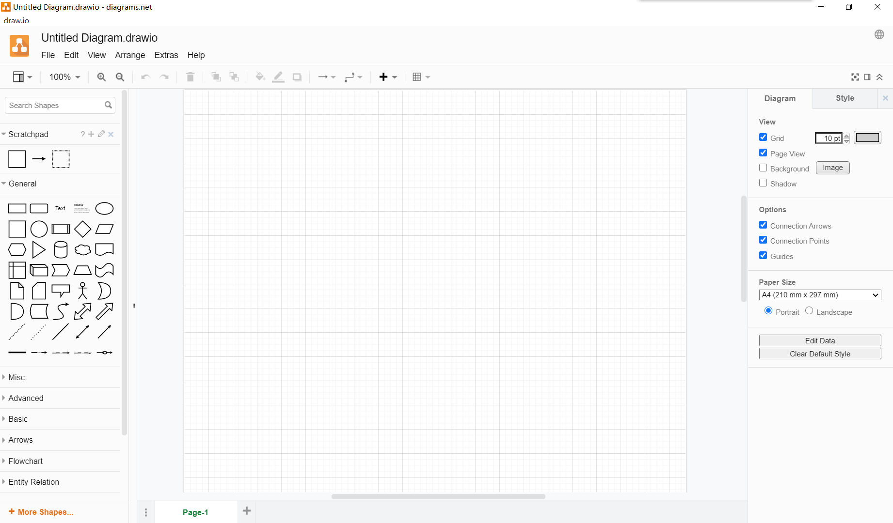

再打开一个空的Excel表格，填入以下内容，纵轴为指令，横轴为流水线阶段。

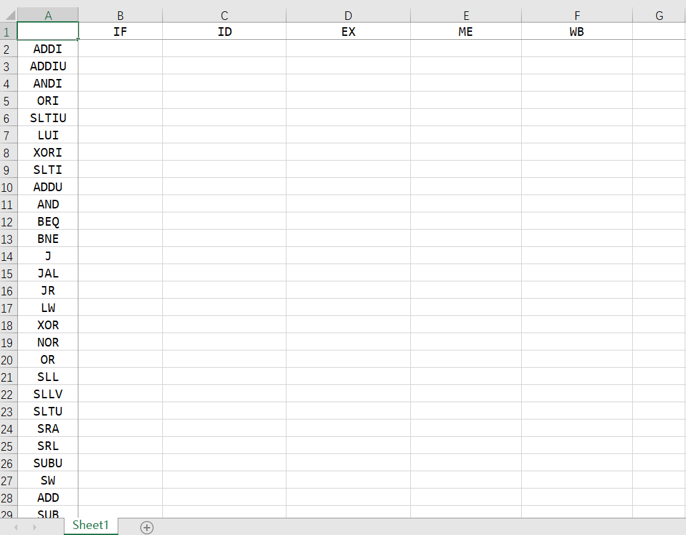

你应该已经知道，一个流水线CPU可以划分为5段，IF段负责取值，ID段负责译码和取出操作数，EX段负责进行数据运算，ME段负责访存存储器，WB负责将数据写回寄存器，段间通过流水寄存器连接。所以我们的设计图应该是这个样子的：

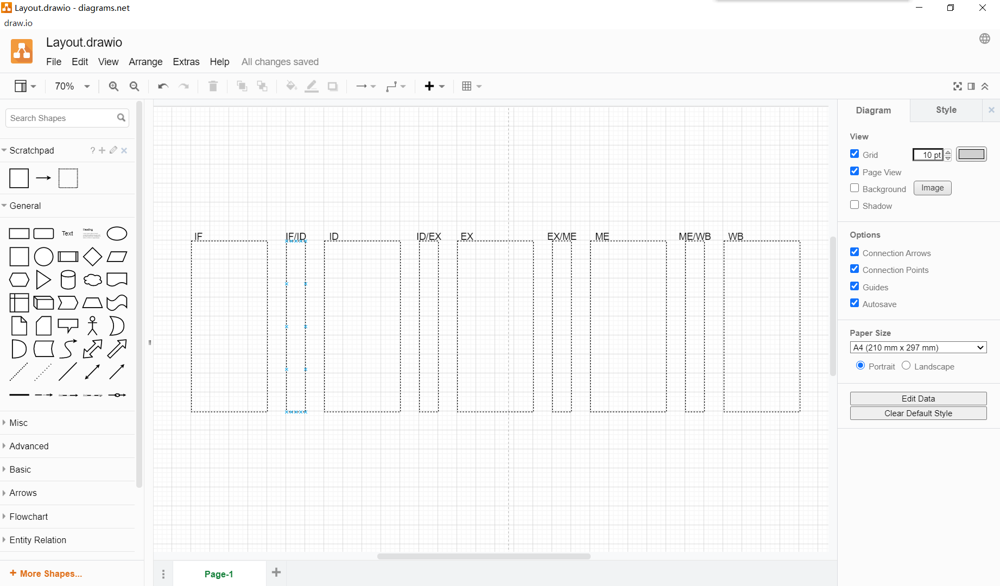

### 运算类指令

下面我们从第一条指令ADDI开始放上我们的部件，同时编排对应的指令流程表。

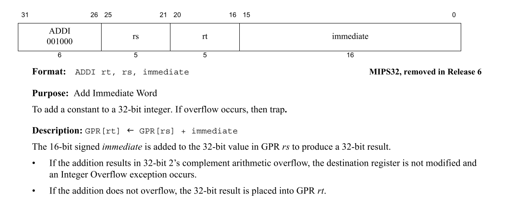

ADDI指令的信息如上图所示，具体过程就是从寄存器堆和指令中取出操作数，进行有符号相加，再把结果送回寄存器。所以在IF段，我们要有PC存指令地址，要有IMEM取指令内容。在ID段要有寄存器堆，要有符号扩展16位的立即数，在EX段要有ALU完成相加。于是我们的设计图变成了这样：

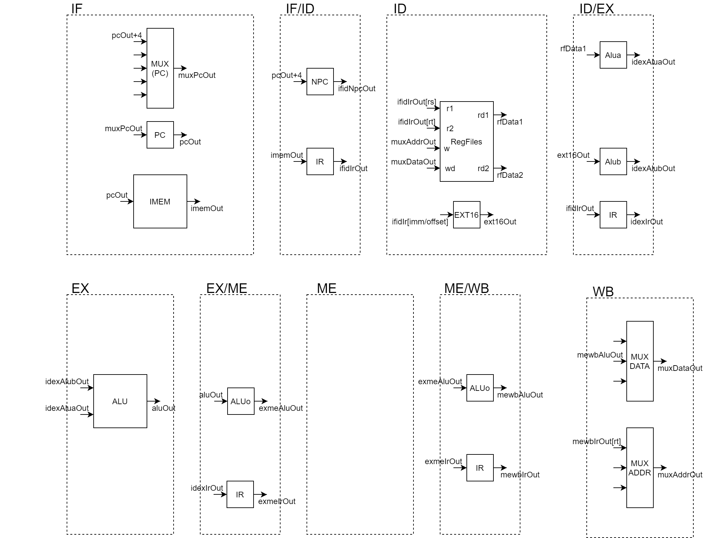

为了方便起见，我们不再连线，而是说明各个部件端口的信号来源。

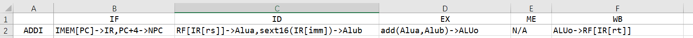

同时在指令流程表中填入以上内容（其实IF段的操作对所有指令都是一样的，可以省略）

### 跳转类指令

其他运算类的指令都和ADDI大同小异，我们就不在此赘述。接下来考虑跳转类指令，以BEQ为例。

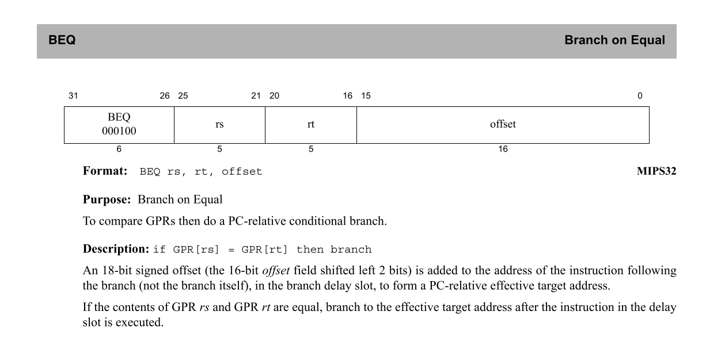

RF[IR[rs]]=RF[IR[rt]]就跳转，跳转目标为NPC+offset。注意，我们需要在ID阶段完成跳转条件的判断和目标地址的生成，因此需要在ID段添加相印的比较和运算部件。同时，我们默认编译器采用了延迟分支，因此不需要排空跳转指令的下条指令。更新后的设计图如下：

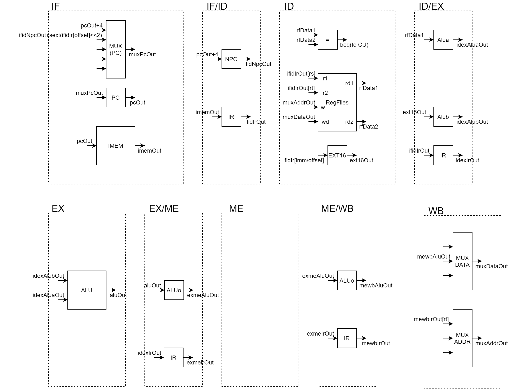

同时在流程表中填入以下内容：


### 存取指令

以SW作为例子，它的具体信息如下：

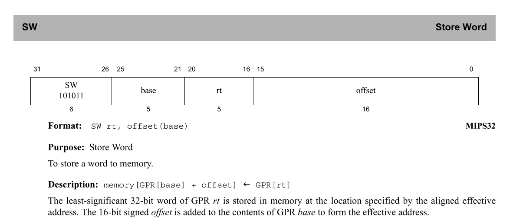

从寄存器堆中读取RF[IR[base]]和RF[rt]，把RF[IR[base]]和offset相加得到数据存储的地址，最后把RF[rt]送入DMEM的这个地址。于是我们把设计图修改成这个样子：

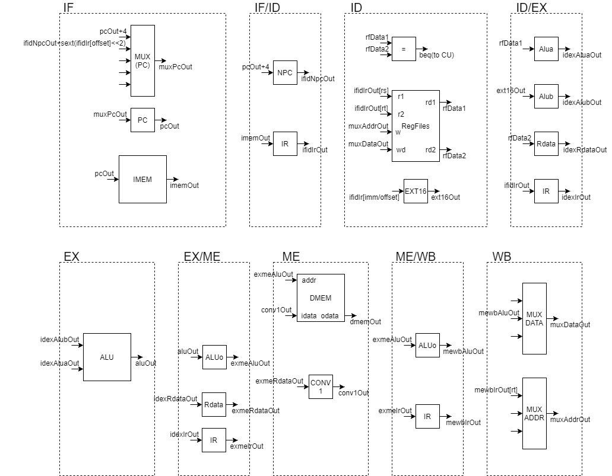

主要是增加了从IF段输出的数据存储器要存储的数据Rdata，以及ME段的部件DMEM和Conv1。Conv1的作用是把来自CPU的32位数据转化成8/16/32位数据存到DMEM的制定位置，因为接下来我们还要面对SB、SH这些存储长度不为整字的指令。同时在流程表中填入以下内容：


接下来再看看LW指令：

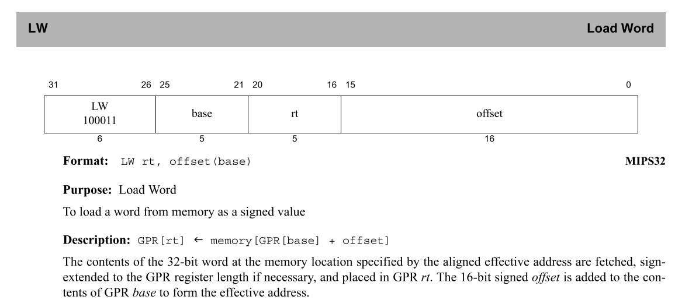

寄存器堆中取出RF[IR[base]]和offset相加作为取出数据的地址，最后把从存储器取出的数据存入寄存器堆的RF[IR[rt]]。于是我们修改设计图如下：

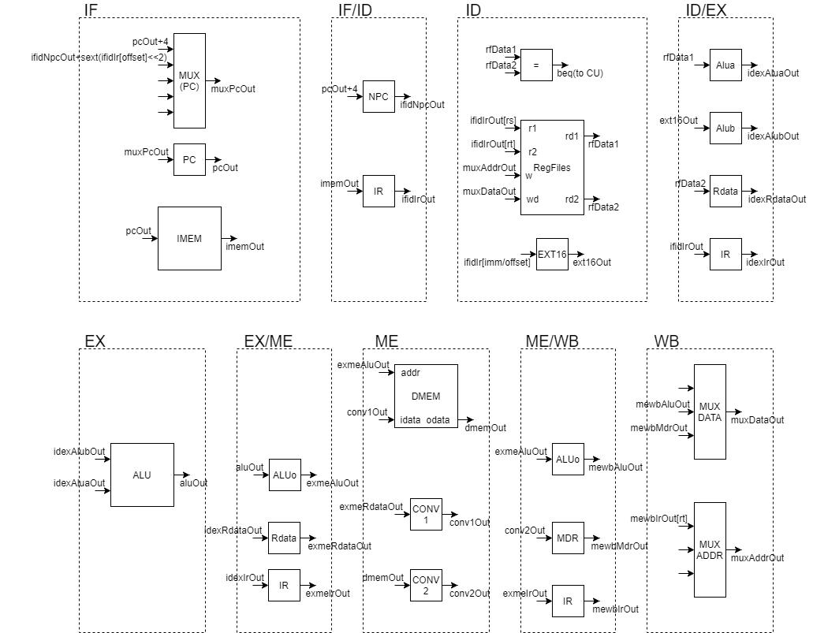

新增的Conv2与Conv1类似，负责将存储器输出的32位数据转换成我们想要的8/16/32位数据，来应对LB、LH的情况。从DMEM读出的数据通过MRD流水寄存器流入WB段，最后写回寄存器堆。同时在流程表中填入以下内容：


### CP0相关

我们先看看CP0的数据移动指令MTC0和MFC0：

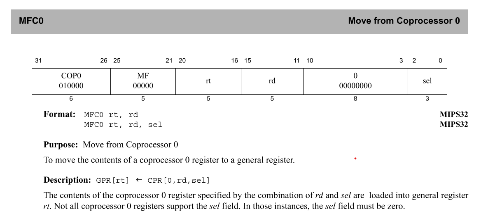

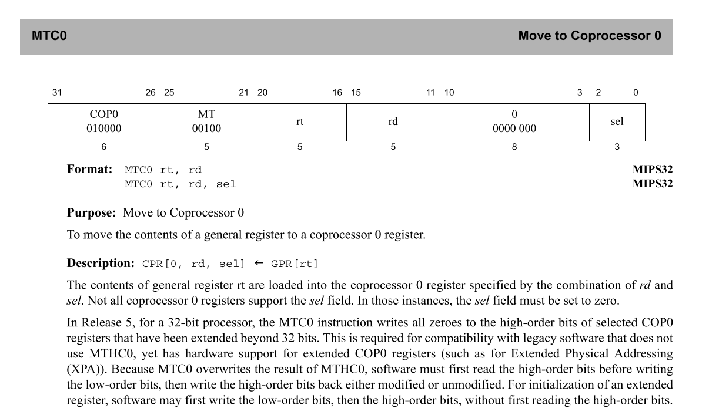

我们应该把CP0放在哪一段？因为CP0和寄存器堆一样有存储功能，所以我选择将CP0放在ID段。MTC0和MFC0同样要经过IF->ID->EX->ME->WB的阶段。数据移动指令不需要在EX段进行运算，但是为了方便起见，我们不在EX段为这些指令设置新的数据通路，而是把这些数据并入ALU的一个操作数通路，EX段在执行这些指令的时候，ALU不对这些数据进行任何操作。与之类似的指令还有MFHI、MFLO、MTHI、MTLO。于是我们修改设计图如下：


同时在流程表中添加以下内容：


SYSCALL等引发异常的指令在ID段就能完成，设计图不需要修改。

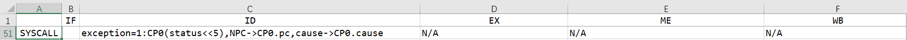

别忘了CP0相关的一条跳转指令ERET：

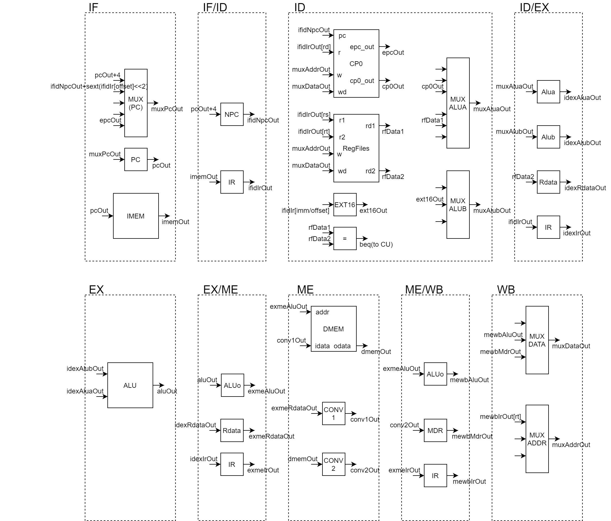


### 继续根据其他指令设计

至此，我们就已经把所有种类的指令都单独拿了一条出来设计，接下来要做的就是以相似的方法完成剩余指令的设计。当所有指令设计完成后，你会得到一张类似于这样的设计图：

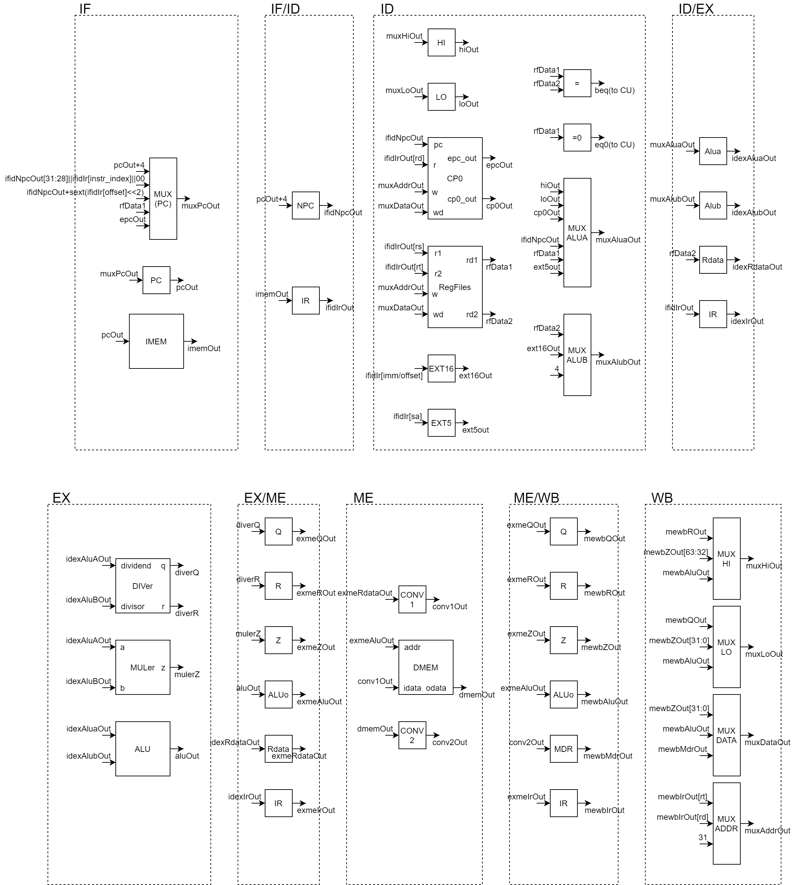

相应的指令流程表也已经给出。完成之后，我们就可以进入下一阶段的工作。

## 控制器设计

我们设计的流水线控制器主要有两个功能：产生控制信号、控制流水线暂停和继续。

在设计之前，我们需要思考几个问题：指令在流水线中执行需要多个周期，如何保证控制器在一个周期发出的信号能够在正确的时间被相应的部件收到？如何判断需要暂停流水线的情况？如何使流水线暂停？为此我们的控制器是组合逻辑还是时序逻辑？

### 一个例子

在一座工厂有一条生产各种产品的流水线，流水线的开始部分流入产品的订单，最后的部分流出最终的产品。一种零件可以被加工成多种形式，所以对于流水线各个部位上的工人来说，他们并不清楚清楚流入的零件应该被加工成什么样。你是这个流水线的指挥员，你要怎么保证流水线能够正常运行？

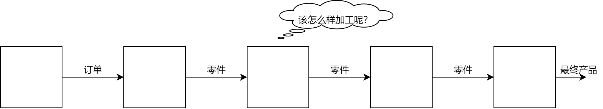

作为指挥员，你对于不同的订单应该采用什么零件，应该被怎么加工了如指掌，但是你要怎么把加工方法告诉流水线各个位置的工人呢？一种方法是，你把完成这个订单所需要的加工方法写成说明书，跟零件一样在各个部分流动。这样对于流水线上一个部分的工人来说，流入的不仅有零件，还有写了如何加工这个零件的说明书，因此工人只要按照说明书上的方法加工零件，再把加工好的零件和说明书传入下一个部分。

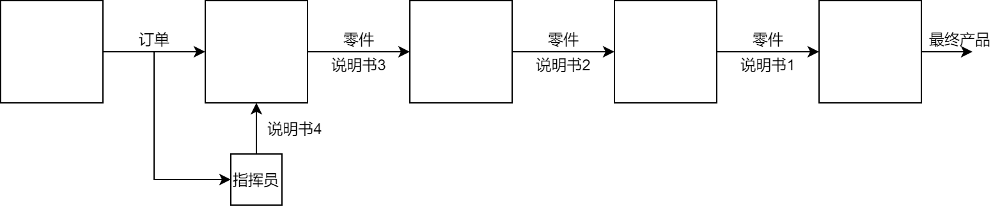

这时又遇到了一些问题，流水线某处的加工需要花上非常长的时间，阻碍到了流水线的流动。另外这个流水线生产的某些产品在后续的订单中要被用到，而这些产品还没有生产完毕时，要用到这些产品的订单就流入了流水线。在这些情况下，必须暂停流水线？但是指挥员要怎么知道什么时候应该暂停流水线？流水线的哪些部分需要暂停？又要已什么形式通知应该暂停的流水线部位？

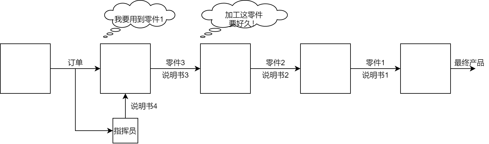

先考虑加工一个零件需要很久的情况，这个工人可以在对讲机里告诉指挥员：“我加工这个零件要好久，能不能暂停我前面的流水线？”于是指挥员拿出大喇叭喊道：“工人X前面的流水线给我暂停！”于是工人X前面的流水线就暂停了，不再接收新的零件和说明书，由于零件没有加工好，工人X也不能给下一个部分提供零件和说明书。知道工人X加工完毕后，指挥员再告诉全体工人流水线继续流动。

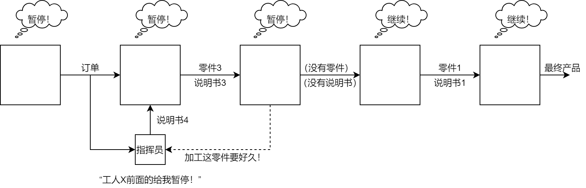

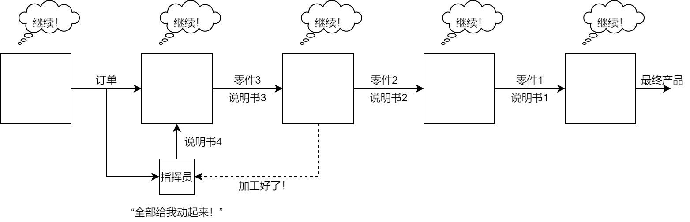

对于后面订单依赖前面产品的情况，我们可以让订单也在流水线中流动，指挥员可以时刻检查各个部分的订单，一旦发现部分X加工的产品是后面订单需要的，就暂停部分X前面的流水线。直到部分X加工的产品流出流水线，流水线才恢复流动。


### CPU中的控制器

没错，我们设计的控制器跟上面的例子是完全类似的。

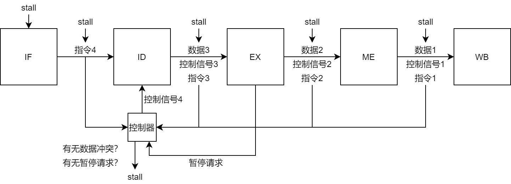

控制器实时接收流水线各段执行的指令：对于ID段的指令，发出执行该条指令所需的所有控制信号，并通过段间流水寄存器传递到各段。对于EX段和ME段的指令，判断是否与ID段的指令产生数据冲突。注意在静态流水线中，只会产生写后读冲突。

控制器同时接收各段发出的暂停流水线请求。

如果存在数据冲突或者暂停请求，就通过stall信号告知需要暂停的部位。段间流水寄存器接收stall信号，在前面的段需要暂停的情况下，如果寄存器后面的段不暂停，就修改自身为空数据，否则保持值不变。同时IF段暂停时，需要保证PC寄存器写无效。

由于控制器所用到的数据全部为本时钟周期的信号，因此控制器是存组合逻辑。

## 开始编写代码

设计完控制器后，我们的设计方案已经基本完善，可以开始编写代码。

回顾我们的设计图先统计一下我们要用到的部件：

- 控制器
- PC寄存器
- 指令存储器和数据寄存器（IP核）
- 寄存器堆
- CP0协处理器
- HI、LO寄存器
- 位拓展模块
- 乘除法器
- ALU
- DMEM的数据位转换模块（Conv1、Conv2）
- 各种多路选择器
- 段间流水寄存器（可以用Verilog的reg实现）

推荐的顺序是：

1. 编写除控制器外部件
2. 编写控制器
3. 连接各模块

### 各部件的编写

由于绝大部分的部件可以沿用之前的代码，因此就不在这里多说。提醒一下根据我们的设计，ALU需要支持直接输出A端和B端的功能。

### 控制器的编写

控制器为纯组合逻辑，因此编写上应该不会遇到太大困难。清点一下我们要用到哪些信号：

- HI、LO写使能
- 传给的cp0指令信号
- 寄存器堆写使能
- 16位符号拓展信号
- 除法器开始信号
- 乘除法器符号信号
- ALU操作种类
- DMEM写使能
- Conv1、Conv2用到的数据（32/16/8，符号）
- 各种多路选择器的选择信号

安排控制信号时，可以先译码出id段当前指令的类型，并在(always *)块中分指令处理。

检测数据冲突时，同样译码出EX、ME段的指令类型，并由此判断是否与ID段的指令存在数据冲突。

具体实现可以参考Code文件夹中的ctrl_unit.v。

### 各段的连接和段间流水寄存器

由于各段之间高度耦合，我没有把各段封装成独立的模块，注意各段之间信号的命名不要冲突。

流水线中断的处理还需要段间流水寄存器来配合，写法如下：

```verilog
always @ (posedge clk or posedge rst) begin
    if (rst or (前段暂停且后段不暂停)) begin
        各寄存器赋成空值
    end
    else if (前段暂停) begin
        各寄存器值保持不变
    end
    else begin
        各寄存器值赋成前段传来的值
    end
end
```

具体实现可以参考Code文件夹中的cpu.v。

## 调试

本次实验采用的测试程序如下：

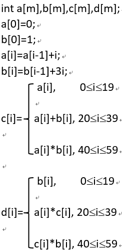

对应的汇编代码和coe文件可以在本仓库中找到。

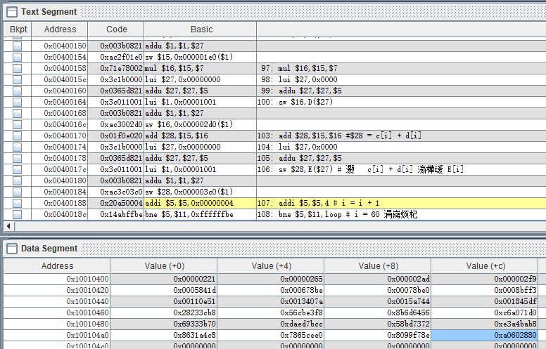

根据Mars模拟器，地址为0x00400184的指令SW\$28, 0x000003c0($1)的指令执行完毕后，E[59]的值0xA0602800被存入地址为0x100104AC的单元，这就是测试程序的运行结果。

如果仿真发现没有出现预料中的结果，大概率是代码出现问题。建议的调试方法和之前一样，使用Mars生成的result.txt比对寄存器的值。

## 综合

在开发如CPU等较复杂的项目时，就需要考虑到时序约束。时钟是我们设计的电路的脉搏，但由于逻辑设计的复杂性，在实际生成的电路中，一条通路可能需要通过大量的逻辑门（这种说法不太准确，但我们先这么理解）。信号通过这些逻辑门和网线是需要时间的，如果信号不能在一个时钟周期内从起点到达终点，就会产生不可知的后果。因此我们需要时许约束，来检测我们设计的电路是否能够在给定的时钟频率下正常工作。

在Vivado中设置时许约束的步骤如下：

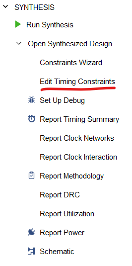

完成综合后，点击Open Synthesized Design，点击Edit Timing Constraints。

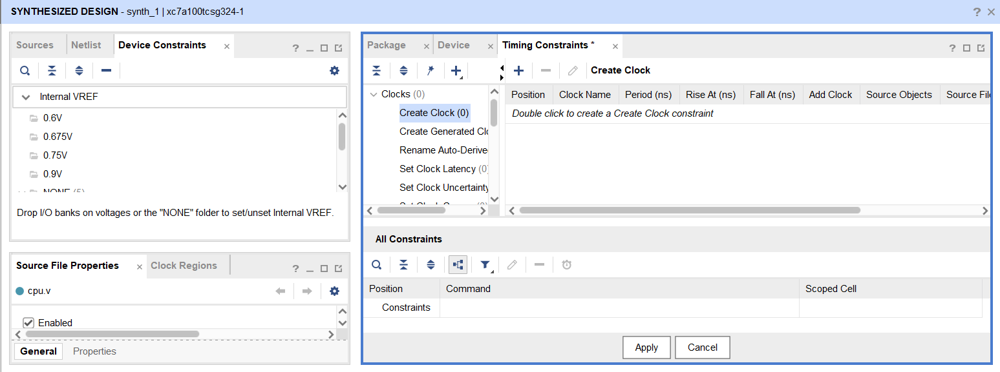

双击Create Clock，创建一个时钟源。

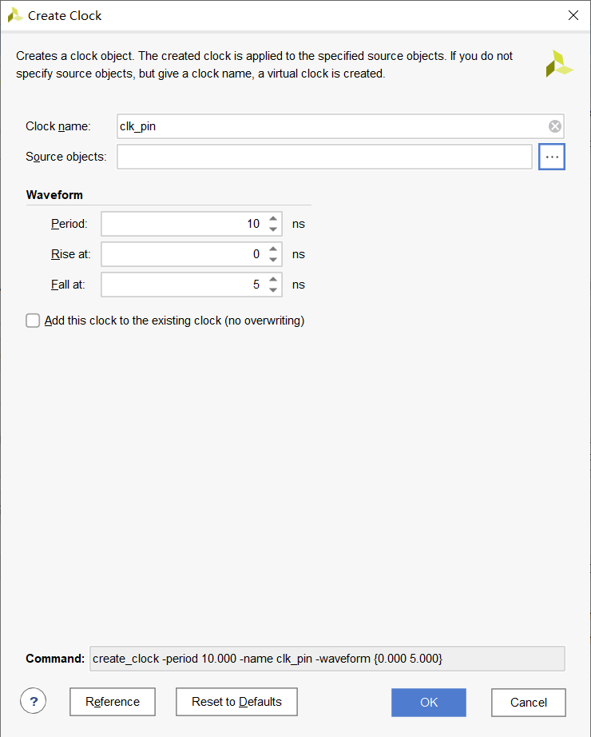

填写时钟源名称，并点击Source objects右侧的"..."，选择作为时钟源的端口。

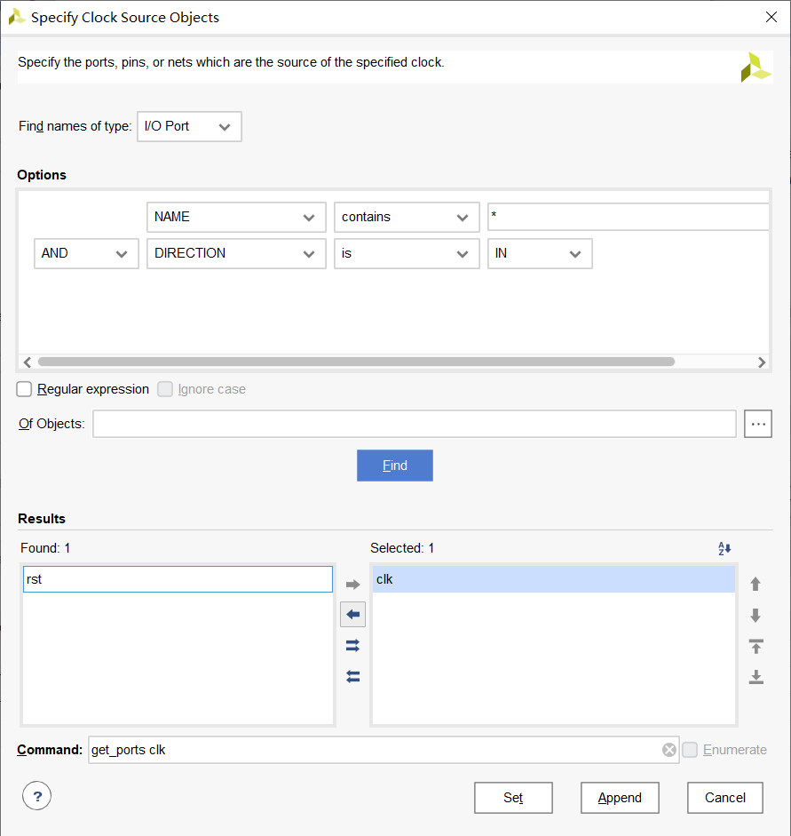

点击find，在下面选择作为时钟源的信号，设置完毕后点击Set。

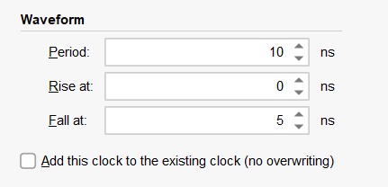

设置时钟周期如上图所示，周期10ns，也就是100MHz，就是板载时钟的频率。点击OK，时序约束设计完毕。在接下来的实现（Implementation）步骤，电路的布局设计会尽可能满足这个时许约束，如果实在不能满足，就会提示“Fail Timing！”。这说明我们的时钟频率过快，适当降频就能满足时许约束。根据经验，10~50MHz的时钟适合绝大多数我们设计的CPU。

## 综合下板

这一步骤就没什么好说的了，祝大家好运！

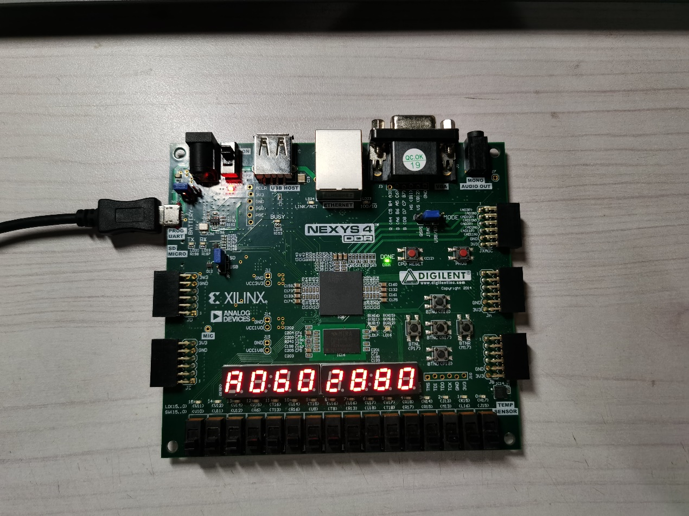

